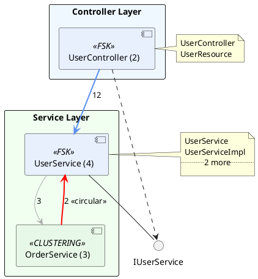

# 技术详解

## 目录

1. [两阶段架构恢复流程](#两阶段架构恢复流程)
2. [FSK功能结构知识](#fsk功能结构知识)
3. [相似度计算与聚类](#相似度计算与聚类)
4. [LLM集成详解](#llm集成详解)
5. [多LLM提供商实现](#多llm提供商实现)
6. [性能优化](#性能优化)
7. [组件图生成算法](#组件图生成算法)
8. [传统四阶段流程（已弃用）](#传统四阶段流程已弃用)

---

## 两阶段架构恢复流程

### 整体架构

系统采用两阶段架构恢复方法，结合功能语义和代码结构进行组件识别：

```
源码解析 → FSK生成 → Embedding生成 → Phase 1 (FSK驱动) → Phase 2 (聚类驱动) → 组件命名优化
```

### 阶段0：源码解析与持久化

**服务**: `SourceCodePersistService`

**功能**:
- 使用JavaParser解析所有`.java`文件
- 提取类信息（包名、类名、修饰符、父类、接口）
- 提取方法和字段信息
- 分析类间依赖关系（继承、实现、字段类型、方法参数）
- 可选：调用LLM生成功能摘要
- 持久化到MySQL数据库

**数据模型**:
```java
ClassInfo {
  id, projectId, packageName, simpleName, fullyQualifiedName,
  classType, modifiers, superClass, interfaces,
  methodNames, fieldNames, javadocComment,
  functionalSummary,  // LLM生成的功能描述
  semanticEmbedding   // 后续生成的向量
}

ClassRelation {
  id, projectId, sourceClassId, targetClassId,
  relationType  // EXTENDS, IMPLEMENTS, USES, DEPENDS
}
```

### 阶段1：FSK生成

**服务**: `FskGenerationService`

**功能**:
- 按包分组类，构建类摘要列表
- 调用LLM分析类摘要，生成功能层级树
- 识别功能节点（父节点）和子功能（子节点）
- 为每个功能节点关联相关类名
- 持久化到`FunctionKnowledge`表

**LLM Prompt结构**:
```
项目名称: {projectName}
类摘要列表:
[com.example.user] UserService - 用户管理服务
[com.example.user] UserController - 用户控制器
[com.example.order] OrderService - 订单处理服务
...

请分析这些类，生成功能层级树，返回JSON格式：
{
  "functions": [
    {
      "name": "UserManagement",
      "description": "用户管理模块",
      "relatedClasses": ["UserService", "UserController", "UserRepository"],
      "relatedTerms": ["user", "authentication", "profile"],
      "children": [
        {
          "name": "UserAuthentication",
          "description": "用户认证子功能",
          "relatedClasses": ["AuthService", "TokenManager"],
          "isLeaf": true
        }
      ]
    }
  ]
}
```

**数据模型**:
```java
FunctionKnowledge {
  id, projectId, parentFunctionId,
  functionName,        // 功能名称
  description,         // 功能描述
  relatedClassNames,   // 逗号分隔的类名列表
  relatedTerms,        // 相关术语
  isLeaf,              // 是否叶子节点
  source               // "LLM" 或 "MANUAL"
}
```

### 阶段2：Embedding生成

**服务**: `SemanticEmbeddingService`

**功能**:
- 为每个类生成语义向量（embedding）
- 使用OpenAI `text-embedding-3-small` 模型（1536维）
- 输入：类的功能摘要（functionalSummary）
- 输出：JSON数组格式的向量字符串
- 更新`ClassInfo.semanticEmbedding`字段
- 支持缓存，跳过已有embedding的类

**API调用**:
```java
POST https://api.openai.com/v1/embeddings
{
  "model": "text-embedding-3-small",
  "input": "UserService - 用户管理服务，提供用户注册、登录、信息更新等功能"
}

Response:
{
  "data": [{
    "embedding": [0.123, -0.456, 0.789, ...]  // 1536维向量
  }]
}
```

### 阶段3：Phase 1 - FSK驱动恢复

**服务**: `Phase1FskRecovery`

**算法**:
1. 读取FSK树的所有叶子节点
2. 对每个叶子节点：
   - 解析`relatedClassNames`字段
   - 查找对应的`ClassInfo`记录
   - 创建`RecoveredComponent`记录
   - 设置`source="FSK"`, `level="COMPONENT"`
3. 返回未被FSK覆盖的类列表

**优点**:
- 基于业务功能分组，符合领域模型
- 利用LLM的语义理解能力
- 适合功能边界清晰的类

**局限**:
- 依赖LLM质量，可能遗漏某些类
- 需要人工审核和编辑FSK

### 阶段4：Phase 2 - 聚类驱动恢复

**服务**: `Phase2ClusteringRecovery`

**算法**:
1. 获取Phase 1未分配的类列表
2. 计算相似度矩阵（N×N，N为未分配类数量）
3. 应用Affinity Propagation聚类算法
4. 为每个聚类创建`RecoveredComponent`
5. 设置`source="CLUSTERING"`, `level="COMPONENT"`

**相似度计算** (`SimilarityCalculator`):

```java
similarity(classA, classB) =
    structWeight × structuralSimilarity(classA, classB) +
    semanticWeight × semanticSimilarity(classA, classB)
```

**结构相似度**:
```java
// 基于依赖关系的Jaccard相似度
Set<String> depsA = getDependencies(classA);  // 类A依赖的所有类
Set<String> depsB = getDependencies(classB);  // 类B依赖的所有类

structuralSimilarity = |depsA ∩ depsB| / |depsA ∪ depsB|
```

**语义相似度**:
```java
// 基于embedding向量的余弦相似度
double[] embA = parseEmbedding(classA.semanticEmbedding);
double[] embB = parseEmbedding(classB.semanticEmbedding);

semanticSimilarity = cosineSimilarity(embA, embB)
                   = (embA · embB) / (||embA|| × ||embB||)
```

**Affinity Propagation聚类** (`AffinityPropagation`):

AP算法通过消息传递找到数据点的"代表点"（exemplar），无需预设聚类数量。

```
输入: 相似度矩阵 S[N×N]
参数: damping (阻尼因子, 0.5-1.0), maxIterations

初始化:
  R[i,k] = 0  (责任度矩阵)
  A[i,k] = 0  (可用度矩阵)

迭代 (直到收敛或达到最大迭代次数):
  1. 更新责任度 R:
     R[i,k] = S[i,k] - max{A[i,k'] + S[i,k']} for k' ≠ k

  2. 更新可用度 A:
     A[i,k] = min{0, R[k,k] + Σ max{0, R[i',k]}} for i' ∉ {i,k}
     A[k,k] = Σ max{0, R[i',k]} for i' ≠ k

  3. 应用阻尼:
     R = damping × R_old + (1-damping) × R_new
     A = damping × A_old + (1-damping) × A_new

  4. 检查收敛:
     exemplars[i] = argmax_k {R[i,k] + A[i,k]}
     如果exemplars连续10次迭代不变，则收敛

输出: 每个数据点的聚类分配 (exemplar索引)
```

**优点**:
- 自动确定聚类数量
- 结合结构和语义信息
- 适合功能边界模糊的类

**局限**:
- 计算复杂度O(N²)，大型项目较慢
- 参数敏感（threshold, damping）

### 阶段5：组件命名优化

**服务**: `ComponentNamingService`

**功能**:
- 为每个识别的组件生成简洁、有意义的名称
- 输入：组件包含的类名列表
- 输出：驼峰命名的组件名（如"UserManagement"）

**LLM Prompt**:
```
这个组件包含以下类:
- UserService
- UserController
- UserRepository
- UserValidator

请为这个组件生成一个简洁的名称（驼峰命名，不超过20字符），返回JSON:
{
  "componentName": "UserManagement"
}
```

### 完整工作流示例

```java
// 1. 上传ZIP，自动执行完整流程
POST /api/parser/upload/recovery
→ 解析源码 (97个类)
→ 生成FSK (15个功能节点)
→ 生成embeddings (97个向量)
→ Phase 1: FSK恢复 (识别5个组件，覆盖60个类)
→ Phase 2: 聚类恢复 (识别3个组件，覆盖37个类)
→ 组件命名优化 (8个组件)
→ 返回结果

// 2. 手动分步执行
POST /api/recovery/{sessionId}/parse
POST /api/recovery/{sessionId}/fsk/generate
GET  /api/recovery/{sessionId}/fsk  // 查看FSK
PUT  /api/recovery/{sessionId}/fsk/3  // 编辑FSK节点
POST /api/recovery/{sessionId}/recover  // 执行恢复
GET  /api/recovery/{sessionId}/result  // 查看结果
```

---

## FSK功能结构知识

### FSK设计目标

1. **弥合代码与业务的鸿沟**：传统方法只能分析代码结构和依赖关系，缺乏对业务功能和领域知识的理解
2. **为架构恢复提供语义指导**：FSK提供功能层级和类分组信息，指导Phase 1恢复
3. **支持人工审核和编辑**：FSK可通过API查看和编辑，改进恢复质量

### FSK数据结构

```java
FunctionKnowledge {
  id: Long                    // 自增主键
  projectId: Long             // 所属项目
  parentFunctionId: Long      // 父功能节点ID（null表示根节点）
  functionName: String        // 功能名称（如"UserManagement"）
  description: String         // 功能描述
  relatedClassNames: String   // 逗号分隔的类名列表
  relatedTerms: String        // 相关术语（逗号分隔）
  isLeaf: Boolean             // 是否叶子节点
  source: String              // "LLM" 或 "MANUAL"
}
```

### FSK树结构示例

```
Root (System)
├─ UserManagement (Parent)
│  ├─ UserAuthentication (Leaf)
│  │  └─ relatedClasses: [AuthService, TokenManager, LoginController]
│  └─ UserProfile (Leaf)
│     └─ relatedClasses: [ProfileService, ProfileController]
├─ OrderManagement (Parent)
│  ├─ OrderProcessing (Leaf)
│  │  └─ relatedClasses: [OrderService, OrderController, OrderValidator]
│  └─ OrderPayment (Leaf)
│     └─ relatedClasses: [PaymentService, PaymentGateway]
└─ ProductManagement (Leaf)
   └─ relatedClasses: [ProductService, ProductController, ProductRepository]
```

### FSK生成流程

1. **类摘要构建**：按包分组，为每个类生成摘要
   ```
   [com.example.user] UserService - 用户管理服务，提供注册、登录功能
   [com.example.user] UserController - 用户REST控制器
   [com.example.order] OrderService - 订单处理服务
   ```

2. **LLM分析**：调用LLM分析类摘要，生成功能树
   ```json
   {
     "functions": [
       {
         "name": "UserManagement",
         "description": "用户管理模块，包含认证和个人信息管理",
         "relatedClasses": ["UserService", "UserController"],
         "relatedTerms": ["user", "authentication", "profile"],
         "children": [...]
       }
     ]
   }
   ```

3. **树结构构建**：解析JSON，建立父子关系，持久化到数据库

4. **人工审核**（可选）：通过API查看和编辑FSK节点

### FSK在架构恢复中的应用

**Phase 1使用FSK**：
- 读取所有叶子节点（`isLeaf=true`）
- 解析`relatedClassNames`字段
- 为每个叶子节点创建一个组件
- 组件名称使用FSK节点的`functionName`

**优势**：
- 基于业务功能分组，符合领域模型
- 利用LLM的语义理解能力
- 支持层级结构（父子关系）

**局限**：
- 依赖LLM质量，可能遗漏某些类
- 需要人工审核和编辑以提高准确性

### FSK编辑API

```bash
# 查看所有FSK节点
GET /api/recovery/{sessionId}/fsk

# 编辑FSK节点
PUT /api/recovery/{sessionId}/fsk/{fskId}
{
  "functionName": "UserManagement",
  "description": "用户管理模块（已编辑）",
  "relatedClassNames": "UserService,UserController,UserRepository,UserValidator"
}
```

---

## 相似度计算与聚类

### 相似度计算原理

系统使用**混合相似度**，结合结构和语义两个维度：

```
similarity(A, B) = α × structural_sim(A, B) + β × semantic_sim(A, B)
```

其中：
- α = `structWeight`（默认0.4）
- β = `semanticWeight`（默认0.6）
- α + β = 1

### 结构相似度

基于类依赖关系的Jaccard相似度：

```java
// 获取类的所有依赖（继承、实现、字段类型、方法参数）
Set<String> getDependencies(ClassInfo cls) {
  Set<String> deps = new HashSet<>();

  // 继承和接口
  if (cls.getSuperClass() != null) deps.add(cls.getSuperClass());
  if (cls.getInterfaces() != null) deps.addAll(Arrays.asList(cls.getInterfaces().split(",")));

  // 类间依赖关系
  List<ClassRelation> relations = classRelationRepository.findBySourceClassId(cls.getId());
  for (ClassRelation rel : relations) {
    deps.add(rel.getTargetClass().getFullyQualifiedName());
  }

  return deps;
}

// Jaccard相似度
double structuralSimilarity(ClassInfo A, ClassInfo B) {
  Set<String> depsA = getDependencies(A);
  Set<String> depsB = getDependencies(B);

  Set<String> intersection = new HashSet<>(depsA);
  intersection.retainAll(depsB);  // A ∩ B

  Set<String> union = new HashSet<>(depsA);
  union.addAll(depsB);  // A ∪ B

  if (union.isEmpty()) return 0.0;
  return (double) intersection.size() / union.size();
}
```

**特点**：
- 值域：[0, 1]
- 0表示无共同依赖，1表示依赖完全相同
- 适合识别技术层面的耦合关系

### 语义相似度

基于embedding向量的余弦相似度：

```java
// 解析embedding字符串为double数组
double[] parseEmbedding(String embeddingJson) {
  // embeddingJson格式: "[0.123, -0.456, 0.789, ...]"
  JsonArray arr = gson.fromJson(embeddingJson, JsonArray.class);
  double[] vec = new double[arr.size()];
  for (int i = 0; i < arr.size(); i++) {
    vec[i] = arr.get(i).getAsDouble();
  }
  return vec;
}

// 余弦相似度
double semanticSimilarity(ClassInfo A, ClassInfo B) {
  double[] embA = parseEmbedding(A.getSemanticEmbedding());
  double[] embB = parseEmbedding(B.getSemanticEmbedding());

  double dotProduct = 0.0;
  double normA = 0.0;
  double normB = 0.0;

  for (int i = 0; i < embA.length; i++) {
    dotProduct += embA[i] * embB[i];
    normA += embA[i] * embA[i];
    normB += embB[i] * embB[i];
  }

  if (normA == 0 || normB == 0) return 0.0;
  return dotProduct / (Math.sqrt(normA) * Math.sqrt(normB));
}
```

**特点**：
- 值域：[-1, 1]，通常在[0, 1]范围内
- 1表示语义完全相同，0表示无关，-1表示相反
- 适合识别业务功能的相似性

### 相似度矩阵构建

```java
// 为N个类构建N×N相似度矩阵
double[][] buildSimilarityMatrix(List<ClassInfo> classes) {
  int N = classes.size();
  double[][] S = new double[N][N];

  for (int i = 0; i < N; i++) {
    for (int j = 0; j < N; j++) {
      if (i == j) {
        S[i][j] = 1.0;  // 自相似度为1
      } else {
        double structSim = structuralSimilarity(classes.get(i), classes.get(j));
        double semanticSim = semanticSimilarity(classes.get(i), classes.get(j));
        S[i][j] = structWeight * structSim + semanticWeight * semanticSim;
      }
    }
  }

  return S;
}
```

**复杂度**：O(N²)，对于大型项目（N>500）可能较慢

### Affinity Propagation聚类

AP算法是一种基于消息传递的聚类算法，无需预设聚类数量。

**核心思想**：
- 每个数据点都可能成为"代表点"（exemplar）
- 通过迭代传递"责任度"和"可用度"消息
- 最终每个点选择一个代表点，形成聚类

**算法步骤**：

1. **初始化**
```java
int N = classes.size();
double[][] R = new double[N][N];  // 责任度矩阵
double[][] A = new double[N][N];  // 可用度矩阵
```

2. **迭代更新**
```java
for (int iter = 0; iter < maxIterations; iter++) {
  // 更新责任度 R[i,k]
  // R[i,k] = S[i,k] - max{A[i,k'] + S[i,k']} for k' ≠ k
  for (int i = 0; i < N; i++) {
    for (int k = 0; k < N; k++) {
      double maxVal = Double.NEGATIVE_INFINITY;
      for (int kp = 0; kp < N; kp++) {
        if (kp != k) {
          maxVal = Math.max(maxVal, A[i][kp] + S[i][kp]);
        }
      }
      R[i][k] = S[i][k] - maxVal;
    }
  }

  // 更新可用度 A[i,k]
  for (int i = 0; i < N; i++) {
    for (int k = 0; k < N; k++) {
      if (i == k) {
        // A[k,k] = Σ max{0, R[i',k]} for i' ≠ k
        double sum = 0.0;
        for (int ip = 0; ip < N; ip++) {
          if (ip != k) {
            sum += Math.max(0, R[ip][k]);
          }
        }
        A[k][k] = sum;
      } else {
        // A[i,k] = min{0, R[k,k] + Σ max{0, R[i',k]}} for i' ∉ {i,k}
        double sum = 0.0;
        for (int ip = 0; ip < N; ip++) {
          if (ip != i && ip != k) {
            sum += Math.max(0, R[ip][k]);
          }
        }
        A[i][k] = Math.min(0, R[k][k] + sum);
      }
    }
  }

  // 应用阻尼（避免震荡）
  R = damping * R_old + (1 - damping) * R;
  A = damping * A_old + (1 - damping) * A;

  // 检查收敛
  if (converged()) break;
}
```

3. **提取聚类**
```java
int[] exemplars = new int[N];
for (int i = 0; i < N; i++) {
  // 选择使 R[i,k] + A[i,k] 最大的k作为代表点
  int bestK = 0;
  double bestVal = R[i][0] + A[i][0];
  for (int k = 1; k < N; k++) {
    double val = R[i][k] + A[i][k];
    if (val > bestVal) {
      bestVal = val;
      bestK = k;
    }
  }
  exemplars[i] = bestK;
}
```

**参数调优**：

| 参数 | 默认值 | 说明 | 调优建议 |
|------|--------|------|----------|
| damping | 0.9 | 阻尼因子 | 0.5-1.0，越大越稳定但收敛慢 |
| maxIterations | 200 | 最大迭代次数 | 增加可能改善收敛 |
| threshold | 0.5 | 相似度阈值 | 降低→更多聚类，提高→更少聚类 |

**优点**：
- 自动确定聚类数量
- 不需要初始化聚类中心
- 适合非球形聚类

**缺点**：
- 时间复杂度O(N²T)，T为迭代次数
- 空间复杂度O(N²)
- 参数敏感，需要调优

---

## LLM集成详解

### LLM应用点总览

| 阶段 | 服务 | 应用 | 输入 | 输出 |
|------|------|------|------|------|
| 源码解析 | SourceCodePersistService | 功能摘要生成 | 类代码 | 功能描述文本 |
| FSK生成 | FskGenerationService | 功能层级树生成 | 类摘要列表 | FSK树（JSON） |
| Embedding | SemanticEmbeddingService | 语义向量生成 | 功能摘要文本 | 1536维向量 |
| 组件命名 | ComponentNamingService | 组件名称优化 | 组件类列表 | 驼峰命名 |
| 传统流程 | LLMService | 语义信息提取 | 代码实体 | 功能描述、领域、术语 |
| 传统流程 | LLMService | 模块命名优化 | 模块信息 | 优化后的名称 |

### API调用流程

**FSK生成调用**:
```java
// 1. 构建类摘要列表
List<String> classSummaries = buildClassSummaries(classes);
// 2. 调用LLM生成FSK
String response = llmService.generateFskForClasses(projectName, classSummaries);
// 3. 解析JSON响应为FSK树
List<FunctionKnowledge> fskNodes = parseFskResponse(projectId, response);
```

**Embedding生成调用**:
```java
// 1. 获取类的功能摘要
String text = classInfo.getFunctionalSummary();
// 2. 调用OpenAI Embedding API
double[] embedding = llmService.generateEmbedding(text);
// 3. 存储为JSON字符串
classInfo.setSemanticEmbedding(Arrays.toString(embedding));
```

**组件命名调用**:
```java
// 1. 构建组件信息
String classNames = component.getClassNames();
// 2. 调用LLM生成名称
String name = componentNamingService.generateName(component, projectId);
// 3. 更新组件名称
component.setName(name);
```

### 错误处理机制

- **重试逻辑**：3次重试，指数退避（针对503/429/500错误）
- **响应缓存**：基于MD5哈希的文件缓存（`.llm-cache/`目录），避免重复API调用
- **限流**：每次请求间隔200-500ms
- **降级**：LLM调用失败时使用默认值或跳过
- **实体过滤**：跳过测试类、配置类、简单POJO

### JSON格式要求

使用OpenAI API的 `response_format: json_object` 时，提示词**必须**包含"json"关键字。所有prompt构建方法已确保包含此关键字。

---

## 多LLM提供商实现

### 架构设计

```java
public enum ProviderType {
    OPENAI, ANTHROPIC, QWEN, CUSTOM
}

private String callLLM(String prompt) {
    switch (llmConfig.getProvider()) {
        case OPENAI: return callOpenAI(prompt);
        case ANTHROPIC: return callAnthropic(prompt);
        case QWEN: return callQwen(prompt);
        case CUSTOM: return callCustomAPI(prompt);
    }
}
```

### API差异处理

| 提供商 | 认证方式 | 请求格式 | 响应内容路径 |
|--------|---------|---------|-------------|
| OpenAI | `Authorization: Bearer sk-...` | OpenAI标准 | `choices[0].message.content` |
| Anthropic | `x-api-key: sk-ant-...` + `anthropic-version` | Anthropic标准 | `content[0].text` |
| Qwen | `Authorization: Bearer sk-...` | OpenAI兼容 | `choices[0].message.content` |

### 配置层次

1. 环境变量（最高优先级）
2. 全局配置（覆盖所有提供商）
3. 提供商配置（各自默认值）

### 添加新提供商

1. 在 `LLMConfig.ProviderType` 枚举中添加
2. 添加提供商配置类
3. 在 `LLMService` 中实现 `call{Provider}` 和 `extract{Provider}Content` 方法
4. 更新 `callLLM` switch语句
5. 更新 `application.yml`

---

## 性能优化

### 已实施的优化

| 优化措施 | 效果 |
|---------|------|
| LLM响应缓存（MD5文件缓存） | 避免重复API调用，二次运行几乎零LLM开销 |
| 批量Prompt优化（5实体/次） | 减少API调用次数 |
| 智能过滤（跳过测试/配置/POJO） | 减少30-50% API调用 |
| Embedding缓存（跳过已有向量的类） | 避免重复embedding生成 |
| 限流控制（200-500ms间隔） | 避免API限流错误 |
| 简化提示词（限制注释200字符） | 减少输入token |

### 性能基准

| 项目规模 | 类数量 | 处理时间 | LLM调用 | 内存占用 |
|---------|--------|---------|---------|---------|
| 小型 | <50 | 1-3分钟 | ~55次 | ~500MB |
| 中型 | 50-200 | 3-10分钟 | ~210次 | ~1GB |
| 大型 | 200-500 | 10-30分钟 | ~510次 | ~1.5GB |
| 超大型 | 500-1000 | 30-60分钟 | ~1010次 | ~2GB |
| 巨型 | 1000+ | 60分钟+ | ~2000次 | ~4GB |

### LLM调用次数估算

```
新版两阶段流程:
  FSK生成: ~1次（所有类摘要合并为一次调用）
  Embedding生成: ~N次（每个类1次，有缓存）
  组件命名: ~C次（每个组件1次）
  总计 ≈ 1 + N + C 次（N=类数量, C=组件数量）

传统四阶段流程:
  语义提取: ~N/5次（5个实体/批）
  系统描述: ~1次
  术语定义: ~T/10次（10个术语/批）
  功能块识别: ~M次（每个模块1次）
  约束分析: ~P次（功能块对数）
  业务规则: ~R次
  模块命名: ~M次
  总计 ≈ N/5 + 1 + T/10 + 2M + P + R 次
```

### 瓶颈分析

| 瓶颈 | 原因 | 优化方案 |
|------|------|----------|
| Embedding生成 | 每个类1次API调用 | 使用缓存，二次运行跳过 |
| 相似度矩阵 | O(N²)计算 | 大型项目考虑采样或分块 |
| AP聚类 | O(N²T)迭代 | 调整damping和maxIterations |
| FSK生成 | 单次LLM调用，输入可能很长 | 分批处理大型项目 |

### 进一步优化建议

**使用更快的模型**：
```yaml
llm:
  openai:
    model: gpt-4o-mini  # 更快更便宜
```

**禁用FSK恢复**（仅使用聚类）：
```json
POST /api/recovery/{sessionId}/recover
{
  "useFskRecovery": false,
  "useClusteringRecovery": true
}
```

**禁用聚类恢复**（仅使用FSK）：
```json
POST /api/recovery/{sessionId}/recover
{
  "useFskRecovery": true,
  "useClusteringRecovery": false
}
```

**禁用LLM**（传统流程）：
```yaml
llm:
  enabled: false
component:
  module-detection:
    use-llm-semantic: false
```

### 内存优化

大型项目增加JVM堆内存：
```bash
# 中型项目
java -Xmx2g -jar target/java-parser-service-1.0.0.jar

# 大型项目
java -Xmx4g -jar target/java-parser-service-1.0.0.jar
```

---

## 组件图生成算法

**服务**: `ComponentDiagramGenerator`

### 整体流程

```
RecoveredComponent列表（数据库）
    → 过滤（source / layer / componentName / maxComponents）
    → 架构层次推断（detectComponentLayer）
    → alias映射生成（唯一性）
    → 类→组件映射构建
    → 组件间依赖聚合（DepInfo）
    → 循环依赖检测
    → 接口信息收集（可选）
    → 按架构层分组渲染
    → 组件类列表附注（note）
    → 依赖箭头渲染（权重 + 颜色编码）
    → PlantUML文本输出
```

### 1. 过滤阶段

支持四个维度的过滤，按顺序依次应用：

| 参数 | 说明 |
|------|------|
| `source` | 按来源过滤（FSK / CLUSTERING / ALL） |
| `layer` | 按架构层次过滤（包含匹配，大小写不敏感） |
| `componentName` | 按组件名称过滤（包含匹配，大小写不敏感） |
| `maxComponents` | 限制最大组件数量（取前N个） |

### 2. 架构层次推断算法（`detectComponentLayer`）

对组件内每个类调用 `detectClassLayer`，统计各架构层的类数量，取数量最多的层次作为组件所属层次（多数投票）。

单类层次推断 `detectClassLayer` 按以下优先级顺序判断：

```
1. 注解优先（最高置信度）
   @Controller / @RestController → Controller Layer
   @Service                      → Service Layer
   @Repository                   → Repository Layer
   @Entity / @Table              → Entity Layer

2. 类名后缀
   *Controller / *Resource / *Endpoint → Controller Layer
   *Service / *ServiceImpl / *Manager
   / *Handler / *Processor            → Service Layer
   *Repository / *Dao / *Mapper       → Repository Layer
   *Entity / *Model / *DTO / *VO / *PO → Entity Layer

3. 包名关键字
   controller / web / api   → Controller Layer
   service                  → Service Layer
   repository / dao / mapper → Repository Layer
   entity / model / domain  → Entity Layer

4. 默认归入 Infrastructure
```

### 3. alias 映射

为每个组件按顺序分配 `C0, C1, C2, ...` 形式的别名，确保 PlantUML 中标识符唯一，避免组件名中特殊字符导致的语法错误。

### 4. 组件间依赖聚合（`DepInfo`）

遍历所有 `ClassRelation` 记录：
- 将源类和目标类各自映射到所属组件
- 跨组件的关系按 `(srcComp, tgtComp)` 聚合，统计各关系类型的出现次数（`typeCounts`）及总次数（`totalCount`）
- 同组件内部依赖和组件外（过滤后不可见组件）依赖均被忽略

`DepInfo.getDominantType()` 用于获取主导关系类型：按出现次数降序，数量相同时按优先级（GENERALIZATION > REALIZATION > COMPOSITION > AGGREGATION > ASSOCIATION > DEPENDENCY）决定。

### 5. 循环依赖检测

```java
// 对componentDeps中的每条 src→tgt 依赖：
// 若 tgt→src 依赖也存在，则标记为循环依赖对
String pairKey = src.compareTo(tgt) < 0 ? src+"|"+tgt : tgt+"|"+src;
circularPairs.add(pairKey);
```

采用规范化的 pairKey（字典序较小的在前），保证每对只记录一次。

### 6. 接口信息收集（可选，`showInterfaces=true`）

**提供接口（Provided Interface）**：扫描组件内 `classType == "Interface"` 的类，收集其 `simpleName`。

**需求接口（Required Interface）**：扫描跨组件的 ClassRelation，若目标类是 Interface，则将其记录为源组件的需求接口。

最多渲染 15 个接口（超出截断）。

### 7. PlantUML 文本生成

#### 样式参数（`appendSkinParams`）

```
top to bottom direction          — 从上至下布局
skinparam linetype ortho         — 正交路由
dpi 150, scale max 4096 width    — 高分辨率输出
componentStyle uml2              — UML2 风格组件符号
defaultFontName "Microsoft YaHei" — 支持中文
```

组件框颜色按来源区分：
- FSK 来源：`#E8F0FE`（蓝色系）
- CLUSTERING 来源：`#E8F8E8`（绿色系）
- 其他：`#F0F0F0`

架构层容器颜色：

| 层次 | 背景色 |
|------|--------|
| Controller Layer | `#F0F8FF` |
| Service Layer | `#F0FFF0` |
| Repository Layer | `#FFF8F0` |
| Entity Layer | `#FFF0F5` |
| Infrastructure | `#F5F5F5` |

#### 组件声明

```plantuml
component "ComponentName (N)" as C0 <<FSK>> #E8F0FE
```

括号内 `N` 为该组件包含的类数量；`<<FSK>>` 为构造型标注。

#### 类列表附注（`appendClassNotes`）

每个组件最多展示 5 个类的简单名，超出部分显示 `.. M more ..`：

```plantuml
note right of C0 : UserService\nUserController\nUserRepository\n.. 2 more ..
```

#### 依赖箭头渲染（`appendDependencies`）

依赖强度通过颜色和线型区分：

| 条件 | 箭头样式 | 含义 |
|------|----------|------|
| 循环依赖 | `-[#FF0000,bold]->` + `<<circular>>` | 红色粗线 |
| totalWeight ≥ 10 | `-[#5B8DEF,bold]->` | 蓝色粗线（强耦合） |
| totalWeight ≥ 5 | `-[#6C757D]->` | 深灰色（中等耦合） |
| totalWeight < 5 | `-[#AAAAAA]->` | 浅灰色（弱耦合） |

箭头标签显示依赖总次数（循环依赖时附加 `<<circular>>`）。使用 `rendered` 集合去重，确保每对 `(srcAlias, tgtAlias)` 只渲染一次。

### 完整 PlantUML 输出结构



---

## 传统四阶段流程（已弃用）

> 注意：以下内容描述的是传统四阶段流程，由 `ComponentGenerationService` 协调。
> 新版本推荐使用两阶段架构恢复流程（`ArchitectureRecoveryOrchestrator`）。
> 传统流程仍可通过 `POST /api/parser/upload/component` 使用。

### 阶段1：预处理 (PreprocessingService)

解析Java源码，提取代码实体和基础信息。

**源码解析**：使用JavaParser遍历所有`.java`文件，提取：
- 类名、包名、完全限定名
- 类型（类、接口、抽象类、枚举）
- 继承关系和接口实现
- 字段信息（名称、类型、修饰符）
- 方法信息（名称、参数、返回类型）
- 注解和注释

**依赖关系构建**：
- 继承依赖（extends）
- 接口依赖（implements）
- 字段类型依赖
- 方法参数和返回类型依赖

**语义信息提取**（需启用LLM）：
- functionalDescription（功能描述）
- businessDomain（业务领域）
- keyTerms（关键术语）
- architectureLayer（架构层次）
- designPatterns（设计模式）
- responsibility（职责描述）

### 阶段2：功能结构知识库构建 (FunctionalKnowledgeBaseBuilder)

利用LLM从代码中提取功能语义信息，构建语义支持系统。

**功能层级结构**（5层）：
```
系统级 (SYSTEM) → 子系统级 (SUBSYSTEM) → 模块级 (MODULE) → 组件级 (COMPONENT) → 特性级 (FEATURE)
```

**核心组件**：
- 功能层级树
- 术语表（LLM批量定义）
- 功能块识别
- 功能约束分析（6种类型：REQUIRES, EXCLUDES, OPTIONAL, MANDATORY, CONDITIONAL, SEQUENCE）
- 业务规则提取（5种类型：VALIDATION, CALCULATION, INFERENCE, CONSTRAINT, WORKFLOW）
- 功能依赖图

### 阶段3：架构恢复 (ArchitectureRecoveryService)

识别功能模块，建立模块间的依赖关系。

**模块识别策略**：
1. 基于包结构的模块识别
2. 基于命名约定的模块识别（Service、Controller、Repository等）
3. 基于依赖分析的模块优化
4. 基于语义相似度的聚类（需启用LLM）

**相似度计算**：
```
相似度 = 0.3 × 包名相似度 + 0.3 × 依赖关系相似度 + 0.4 × 语义相似度
```

### 阶段4：组件图生成 (ComponentDiagramService)

- 模块命名优化（使用LLM）
- 创建UML组件（Eclipse UML2 API）
- 创建组件依赖（Usage关系）
- 创建接口和端口（Provided/Required Interface）
- 导出XMI文件

---

## 数据模型

### JPA实体（MySQL持久化）

#### Project
项目元数据，跟踪会话和处理状态。

| 字段 | 类型 | 说明 |
|------|------|------|
| id | Long | 自增主键 |
| sessionId | String | 会话ID（UUID） |
| name | String | 项目名称 |
| sourcePath | String | 源码路径 |
| status | String | 状态：UPLOADED/PARSED/RECOVERED |

#### ClassInfo
解析后的类信息，包含embedding向量。

| 字段 | 类型 | 说明 |
|------|------|------|
| id | Long | 自增主键 |
| projectId | Long | 所属项目 |
| packageName | String | 包名 |
| simpleName | String | 简单类名 |
| fullyQualifiedName | String | 全限定名 |
| classType | String | 类型：CLASS/INTERFACE/ENUM/ABSTRACT |
| modifiers | String | 修饰符 |
| superClass | String | 父类 |
| interfaces | String | 实现的接口（逗号分隔） |
| methodNames | TEXT | 方法名列表 |
| fieldNames | TEXT | 字段名列表 |
| javadocComment | TEXT | Javadoc注释 |
| functionalSummary | String | LLM生成的功能摘要 |
| semanticEmbedding | MEDIUMTEXT | 1536维embedding向量（JSON数组） |

#### ClassRelation
类间依赖关系。

| 字段 | 类型 | 说明 |
|------|------|------|
| id | Long | 自增主键 |
| projectId | Long | 所属项目 |
| sourceClassId | Long | 源类ID |
| targetClassId | Long | 目标类ID |
| relationType | String | 关系类型：EXTENDS/IMPLEMENTS/USES/DEPENDS |

#### FunctionKnowledge
FSK功能树节点。

| 字段 | 类型 | 说明 |
|------|------|------|
| id | Long | 自增主键 |
| projectId | Long | 所属项目 |
| parentFunctionId | Long | 父节点ID（null=根节点） |
| functionName | String | 功能名称 |
| description | String | 功能描述 |
| relatedClassNames | TEXT | 关联类名（逗号分隔） |
| relatedTerms | String | 相关术语（逗号分隔） |
| isLeaf | Boolean | 是否叶子节点 |
| source | String | 来源：LLM/MANUAL |

#### RecoveryResult
架构恢复执行记录。

| 字段 | 类型 | 说明 |
|------|------|------|
| id | Long | 自增主键 |
| projectId | Long | 所属项目 |
| structWeight | Double | 结构权重 |
| semanticWeight | Double | 语义权重 |
| threshold | Double | 聚类阈值 |
| totalComponents | Integer | 组件总数 |
| totalClasses | Integer | 类总数 |
| processingTimeMs | Long | 处理耗时（毫秒） |
| createdAt | Timestamp | 创建时间 |

#### RecoveredComponent
识别的组件及其类分配。

| 字段 | 类型 | 说明 |
|------|------|------|
| id | Long | 自增主键 |
| recoveryResultId | Long | 所属恢复结果 |
| name | String | 组件名称 |
| parentComponentId | Long | 父组件ID |
| level | String | 层级：COMPONENT |
| classNames | TEXT | 包含的类名（逗号分隔） |
| source | String | 来源：FSK/CLUSTERING |

### 内存数据模型（传统流程）

#### CodeEntity
代码实体，包含类、接口、方法、字段等信息。用于传统四阶段流程的内存处理。

#### SemanticInfo
LLM提取的语义信息：功能描述、业务领域、关键术语、架构层次、设计模式、职责描述。

#### KnowledgeBase
知识库，包含所有实体、模块、术语表和依赖关系图。

#### FunctionalKnowledgeBase
扩展知识库，包含功能层级、术语表、功能块、功能约束、业务规则、功能依赖图。

#### FunctionalModule
功能模块，表示组件图中的组件，包含实体集合、依赖关系、内聚度/耦合度指标。

---

## 依赖项

| 依赖 | 版本 | 用途 |
|------|------|------|
| JavaParser | 3.28.0 | Java代码解析和AST分析（BLEEDING_EDGE语言级别） |
| Eclipse EMF | 2.35.0 | EMF模型框架 |
| Eclipse UML2 | 5.0.1 | UML 2.0元模型支持 |
| Spring Boot | 2.7.14 | Web框架和依赖注入 |
| Spring Data JPA | 2.7.x | ORM和仓库抽象 |
| MySQL Connector/J | 8.0.x | MySQL数据库驱动 |
| Gson | - | JSON解析（LLM响应） |
| Lombok | - | 减少样板代码 |
| PlantUML | 1.2024.3 | 图表渲染（PNG/SVG） |
| Apache Commons Math | 3.6.1 | Affinity Propagation聚类算法 |
| Commons IO | 2.15.1 | 文件处理工具 |

> 注意：EMF/UML2版本紧密耦合，修改pom.xml依赖前请充分测试。
